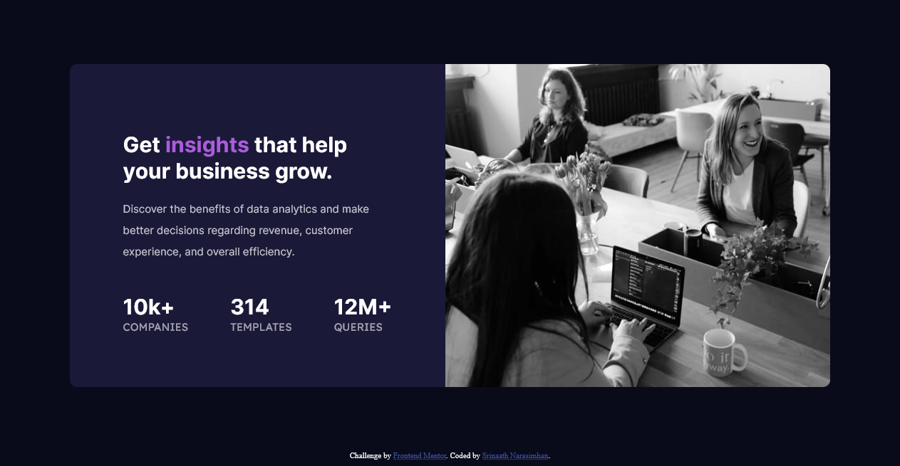
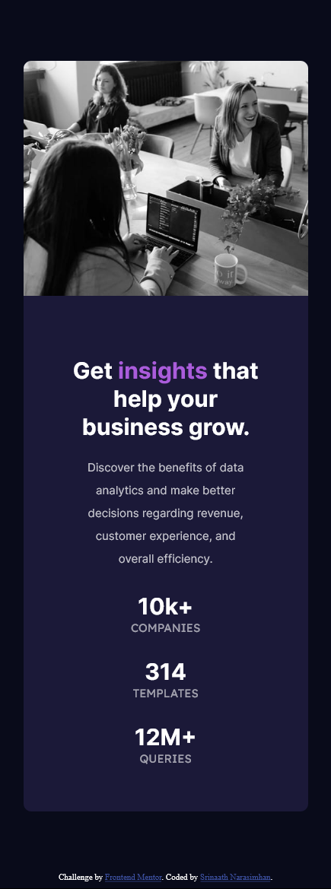

# Frontend Mentor - Stats preview card component

## Welcome! 👋

Thanks for checking out this front-end coding challenge.

[Frontend Mentor](https://www.frontendmentor.io) challenges help you improve your coding skills by building realistic projects.

# Frontend Mentor - Stats preview card component solution

This is a solution to the [Stats preview card component challenge on Frontend Mentor](https://www.frontendmentor.io/challenges/stats-preview-card-component-8JqbgoU62). Frontend Mentor challenges help you improve your coding skills by building realistic projects. 

## Table of contents

- [The challenge](#the-challenge)
- [Screenshot](#screenshot)
- [Links](#links)

- [Built with](#built-with)

- [Author](#author)
- [Acknowledgments](#acknowledgments)

### The challenge

Users should be able to:

- View the optimal layout depending on their device's screen size

### Screenshot

 this picture depicts the desktopUI
 this picture depicts the mobileUI

### Links

- Solution URL: [Add solution URL here](https://your-solution-url.com)
- Live Site URL: [Add live site URL here](https://your-live-site-url.com)

### Built with

- Semantic HTML5 markup
- CSS custom properties
- Flexbox
- Mobile-first workflow
- [Styled Components]  [Inter](https://fonts.google.com/specimen/Inter) and [Lexend Deca](https://fonts.google.com/specimen/Lexend+Deca)

**Note: These are just examples. Delete this note and replace the list above with your own choices**

## Author

- Website - [SRINAATH NARASIMHAN](https://www.your-site.com)
- Frontend Mentor - [@thaanirs](https://www.frontendmentor.io/profile/thaanirs)

**Note: Delete this note and add/remove/edit lines above based on what links you'd like to share.**

## Acknowledgments
I made this project in collaboration with @varun

